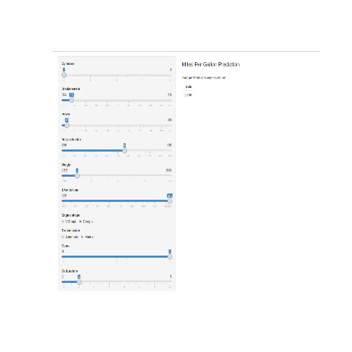

Week 4 Developing Data Products
========================================================
author: Zito Relova
date: January 28, 2019
autosize: true

Overview
========================================================

This application allows the user to predict their average miles per gallon (MPG) consumption based on different 
attributes of their car. The user interface uses a mix of sliders and radio buttons in order to select the attributes.


Car Attributes
========================================================

- cyl - the number of cylinders in the engine 
- disp - the engine displacement in cubic inches
- hp - the engine's gross horsepower in HP
- drat - the rear axle ratio
- wt - the weight in 1000's of lbs 
- qsec - the 1/4 mile time in seconds
- vs - the engine cylinder configuration(V-shape or straight)
- am - the transmission type (automatic or manual)
- gear - the number of forward gears in the transmission
- carb - the number of carburetor barrels
- mpg - miles per gallon calculation


```
 [1] "mpg"  "cyl"  "disp" "hp"   "drat" "wt"   "qsec" "vs"   "am"   "gear"
[11] "carb"
```

Model
========================================================

In order to accurately predict the average MPG consumption of the vehicle, a random forest model was used. 
The input to the model were the car attributes eg. cyl, disp, hp, etc. and the output was the number of miles per gallon. 


User Interface
========================================================

Here is the application's interface.

